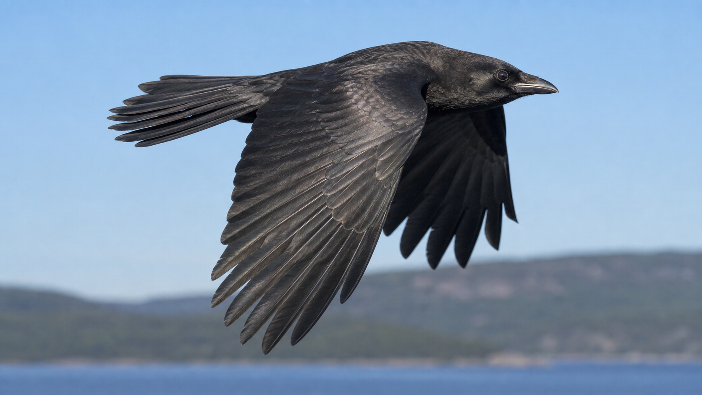

# American-crow hybrid visual model

BirdFlowMetal's crow is a high-quality native Metal **estimated hybrid**, not a
measured crow. Its machine-readable parameter and provenance record is
[`american-crow-hybrid-visual-v1.json`](../ValidationInputs/american-crow-hybrid-visual-v1.json).



The hero is a generated visual interpretation, not a photograph. Its exact
dimensions, checksum, reference roles, prompt contract, and claim boundary are
locked in
[`american-crow-hybrid-hero-v1.json`](../ValidationArtifacts/american-crow-hybrid-hero-v1.json).

## What is real, inferred, and artistic

| Layer | Evidence | Use in the crow |
|---|---|---|
| Deetjen OB F03 surface sequence | 144 source frames at 1000 Hz; 2,157 vertices; 3,968 triangles | Real non-rigid articulation scaffold after translation removal and allometric remapping |
| American-crow CT screening | Three folded `Corvus brachyrhynchos` public-viewer volumes | Gross skeletal proportion and physical-extent plausibility only |
| Jackson and Dial corvid experiment | Three American crows, synchronized 250 Hz three-view capture, takeoff and muscle measurements | Burst-flight context and frequency plausibility; no unavailable crow landmarks are reconstructed or implied |
| Published and museum morphometrics | Adult mass, wing chord, tail, bill, tarsus, total-length and wingspan ranges | Selected midpoint-scale target with ranges retained in the JSON |
| American-crow plumage study and current flight photographs | Region-dependent black plumage, gloss, UV/visible hue, flight-feather and squared-tail silhouette | Procedural feather layering and view-dependent blue/violet sheen |
| Renderer additions | Head, bill, eyes, nostril bristles, explicit primaries/secondaries/retrices, contour-feather relief | Artistic geometry constrained by the sources above |

The selected visual target is a `0.46 m`, `0.45 kg` adult with a `0.91 m`
wingspan, `0.174 m` tail, and `0.049 m` bill. These are useful central estimates,
not a same-specimen measurement. The display wingbeat is `4.6 Hz`; the original
dove sequence supplies phase shape, not crow timing.

## Native Metal capture

The native renderer consumes both locked inputs and keeps the generated hero
separate from executable geometry:


[View the two-second native Metal wingbeat](Media/american-crow-hybrid-native-v1.mp4).
Its encoding, input hashes, Apple-Metal execution record, seam check, and claim
boundary are locked in
[`american-crow-hybrid-native-v1.json`](../ValidationArtifacts/american-crow-hybrid-native-v1.json).

```bash
swift build -c release --product birdflow-viewer
.build/release/birdflow-viewer \
  --capture-crow-frames /tmp/birdflow-crow \
  --capture-crow-dove-manifest \
    ValidationInputs/deetjen-ob-f03-surface-v1/manifest.json \
  --capture-crow-profile \
    ValidationInputs/american-crow-hybrid-visual-v1.json \
  --capture-width 1600 \
  --capture-height 900 \
  --capture-frames 48
```

It verifies the dove manifest SHA-256 before rendering, resamples the measured
deformation into a bilaterally symmetrized, more laterally extended crow
presentation pose, and builds the bird from a smooth body/head loft plus
explicit primary, secondary, covert, contour, and tail feathers. Four-sample
Metal rasterization and a dedicated eumelanin shader provide view-dependent
cool sheen while keeping the bird visually black. The native result is an
executable motion and material estimate; it is deliberately not presented as
the photoreal appearance target established by the generated hero.

## Sources

- Deetjen et al., *eLife* (2024), DOI `10.7554/eLife.89968` and Dryad DOI
  `10.5061/dryad.wwpzgmsqs`.
- Jackson and Dial, *Journal of Experimental Biology* 214:452-461, DOI
  `10.1242/jeb.046789`.
- Yorzinski and Clark, *Journal of Avian Biology* (2026), DOI
  `10.1002/jav.03604`.
- Cornell Lab of Ornithology / Macaulay Library American-crow flight and profile
  assets `59858031`, `93750891`, and `421209111`. They were used as viewing
  references and are not redistributed.
- The local rights-aware CT and data audit:
  [`corvid-public-source-screening.json`](../ValidationArtifacts/corvid-public-source-screening.json).

## Claim boundary

The crow can support visual design, renderer testing, and explicitly hybrid
sensitivity work. It cannot establish measured crow aerodynamics, force, power,
inertia, free flight, or same-specimen anatomy. Any future quantitative crow
solver input still needs bilateral flight surfaces, synchronized kinematics,
mass, center of mass, and inertia from a traceable specimen.
