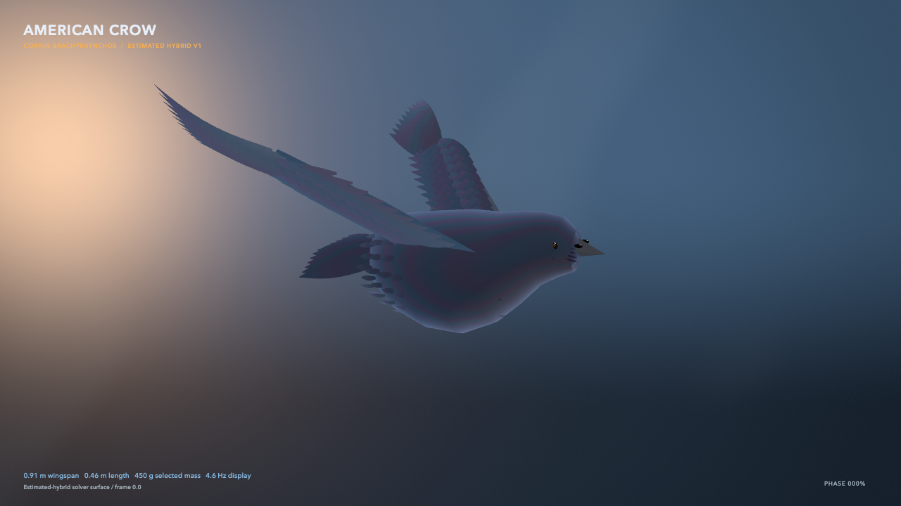

# American-crow estimated simulation model

BirdFlowMetal's crow is a high-quality native Metal **estimated hybrid**, not a
measured crow. Its machine-readable parameter and provenance record is
[`american-crow-hybrid-visual-v1.json`](../ValidationInputs/american-crow-hybrid-visual-v1.json).
The persistent anatomy, stable feather identities, rendering LOD contract, and
physics-surface anchors are defined separately in
[`BIRD_REALITY_ASSET.md`](BIRD_REALITY_ASSET.md).



[View the two-second native Metal wingbeat](Media/american-crow-hybrid-native-v1.mp4).
This page shows only output from the executable renderer; reference photographs
and generated appearance targets are not displayed or distributed.

## What is real, inferred, and artistic

| Layer | Evidence | Use in the crow |
|---|---|---|
| Deetjen OB F03 surface sequence | 144 source frames at 1000 Hz; 2,157 vertices; 3,968 triangles | Real non-rigid articulation scaffold after translation removal and allometric remapping |
| American-crow CT screening | Three folded `Corvus brachyrhynchos` public-viewer volumes | Gross skeletal proportion and physical-extent plausibility only |
| Jackson and Dial corvid experiment | Three American crows, synchronized 250 Hz three-view capture, takeoff and muscle measurements | Burst-flight context and frequency plausibility; no unavailable crow landmarks are reconstructed or implied |
| Published and museum morphometrics | Adult mass, wing chord, tail, bill, tarsus, total-length and wingspan ranges | Selected midpoint-scale target with ranges retained in the JSON |
| American-crow plumage study and current flight photographs | Region-dependent black plumage, gloss, UV/visible hue, flight-feather and squared-tail silhouette | Procedural feather layering and view-dependent blue/violet sheen |
| Renderer additions | Head, bill, eyes, nostril bristles, explicit primaries/secondaries/retrices, contour-feather relief | Artistic geometry constrained by the sources above |

The selected visual target is a `0.46 m`, `0.45 kg` adult with a `0.91 m`
wingspan, `0.174 m` tail, and `0.049 m` bill. These are useful central estimates,
not a same-specimen measurement. The display wingbeat is `4.6 Hz`; the original
dove sequence supplies phase shape, not crow timing.

The standing presentation uses an asymmetric axial body loft rather than an
ellipsoid: separate dorsal and ventral envelopes form the mantle, shoulder,
breast/sternum, pelvic taper, and narrowing neck transition. Overlapping contour
and folded-wing covert rows then break up the analytic surface. These remain
estimated presentation geometry; they are not inferred skeletal landmarks or a
measured body scan.

Sparse diagnostic captures can set `--capture-crow-camera-yaw` in radians so a
geometry milestone is checked from a new view without changing the release
camera or multiplying appearance-only review frames.

## Native Metal capture

The native renderer consumes both locked inputs. Its encoding, input hashes,
Apple-Metal execution record, seam check, and claim boundary are locked in
[`american-crow-hybrid-native-v1.json`](../ValidationArtifacts/american-crow-hybrid-native-v1.json).

```bash
swift build -c release --product birdflow-viewer
.build/release/birdflow-viewer \
  --capture-crow-frames /tmp/birdflow-crow \
  --capture-crow-surface-manifest \
    ValidationInputs/american-crow-hybrid-surface-v1/manifest.json \
  --capture-crow-surface-generation-audit \
    ValidationArtifacts/american-crow-hybrid-surface-generation-v1.json \
  --capture-crow-profile \
    ValidationInputs/american-crow-hybrid-visual-v1.json \
  --capture-crow-reality-asset \
    ValidationInputs/american-crow-hybrid-reality-v1.json \
  --capture-width 1600 \
  --capture-height 900 \
  --capture-frames 48
```

It verifies the reality asset, crow-surface manifest, generating profile, and
their SHA-256 locks before rendering. One retained Metal pass evaluates current
and previous tangent frames for all `54` persistent flight/tail feather roots;
a second expands a shared twelve-section vane template into `3,888` renderable
vertices. Current and previous positions plus stable feather IDs stay GPU-side.
The physical wing/tail surface supplies an attachment underlayer, while the
smooth body/head, coverts, and contour feathers remain procedural estimates.
Four-sample Metal rasterization and a dedicated eumelanin shader provide
view-dependent cool sheen while keeping the bird visually black. The native
result is an executable motion and material estimate, not a photograph.
Before display tone mapping, the same pass emits a scene-linear HDR image and
typed albedo/material, normal/coverage, metric-depth, and deformation-motion
AOVs. A separate single-sample integer pass preserves exact surface and feather
identity. The executable conventions and qualification are in
[`CROW_TEMPORAL_AOVS.md`](CROW_TEMPORAL_AOVS.md). A capability-gated MetalFX
path reconstructs lower-resolution inputs only when explicitly requested; the
native-resolution renderer remains its executable parity oracle.
The beauty mesh and fluid boundary mesh are intentionally distinct: the former
adds feather detail, while the latter remains the fixed-topology coupling input.

The same executable renderer also has a distinct `standing` presentation. It
does not freeze or slow the flight surface. A dedicated Metal kernel folds the
same `54` persistent feathers against the body and retains current/previous
state, while an analytic leg chain supplies feathered upper legs, scaled
tarsometatarsi, three anterior digits, an opposing hallux, claws, and explicit
support contact. The qualitative source observations and exclusions are in
[`CROW_STANDING_ANATOMY.md`](CROW_STANDING_ANATOMY.md); no source-media bytes
are stored or displayed.

```bash
./Scripts/capture-crow-showcase.sh \
  /tmp/american-crow-standing.mp4 \
  /tmp/american-crow-standing.png \
  standing
```

## Apple-GPU simulation surface

The solver-facing crow is a separate fixed-topology asset generated from the
same profile:

- `49` frames over one estimated `4.6 Hz` presentation cycle;
- `2,157` vertices and `3,968` triangles in canonical body, left-wing,
  right-wing, and tail ranges;
- exact endpoint closure and bilaterally symmetrized wing vertices;
- `uint16` indexing below the live Metal `4,096`-triangle identifier limit;
- locked profile, dove-scaffold, position-stream, triangle-stream, and manifest
  SHA-256 values.

Regenerate it deterministically with:

```bash
./Scripts/build-american-crow-surface.py
```

Exercise the live Apple-GPU path with:

```bash
swift build -c release --product birdflow
.build/release/birdflow simulate american-crow \
  --archive ValidationArtifacts/american-crow-hybrid-metal-sim-readiness-v1.json
```

The committed Apple M4 run passed all-frame indexed preparation and
rasterization, exact CPU/GPU occupancy at five milestone frames, and the
production moving-boundary/TRT coupling gate. Its `8` fluid steps produced
`25` newly covered and `25` newly uncovered events, zero topology-counter
mismatch, wall Mach `0.0693`, and a relative RMS impulse-closure residual of
`4.28e-6`. This makes the asset executable simulation plumbing, not calibrated
crow aerodynamics: developed flow, grid convergence, force accuracy, mass
properties, trim, and free flight remain open.

The generation record is
[`american-crow-hybrid-surface-generation-v1.json`](../ValidationArtifacts/american-crow-hybrid-surface-generation-v1.json),
and the owning live-Metal result is
[`american-crow-hybrid-metal-sim-readiness-v1.json`](../ValidationArtifacts/american-crow-hybrid-metal-sim-readiness-v1.json).

## Sources

- Deetjen et al., *eLife* (2024), DOI `10.7554/eLife.89968` and Dryad DOI
  `10.5061/dryad.wwpzgmsqs`.
- Jackson and Dial, *Journal of Experimental Biology* 214:452-461, DOI
  `10.1242/jeb.046789`.
- Yorzinski and Clark, *Journal of Avian Biology* (2026), DOI
  `10.1002/jav.03604`.
- Cornell Lab of Ornithology / Macaulay Library American-crow flight and profile
  assets `59858031`, `93750891`, and `421209111`. They were used as viewing
  references and are not redistributed.
- The local rights-aware CT and data audit:
  [`corvid-public-source-screening.json`](../ValidationArtifacts/corvid-public-source-screening.json).

## Claim boundary

The crow can support visual design, renderer testing, and explicitly hybrid
sensitivity work. It cannot establish measured crow aerodynamics, force, power,
inertia, free flight, or same-specimen anatomy. Any future quantitative crow
solver input still needs bilateral flight surfaces, synchronized kinematics,
mass, center of mass, and inertia from a traceable specimen.
