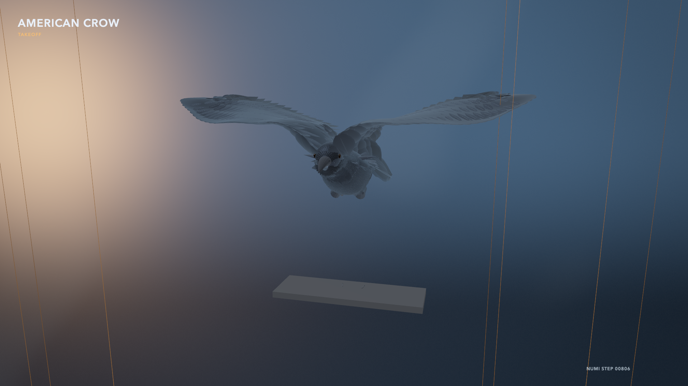
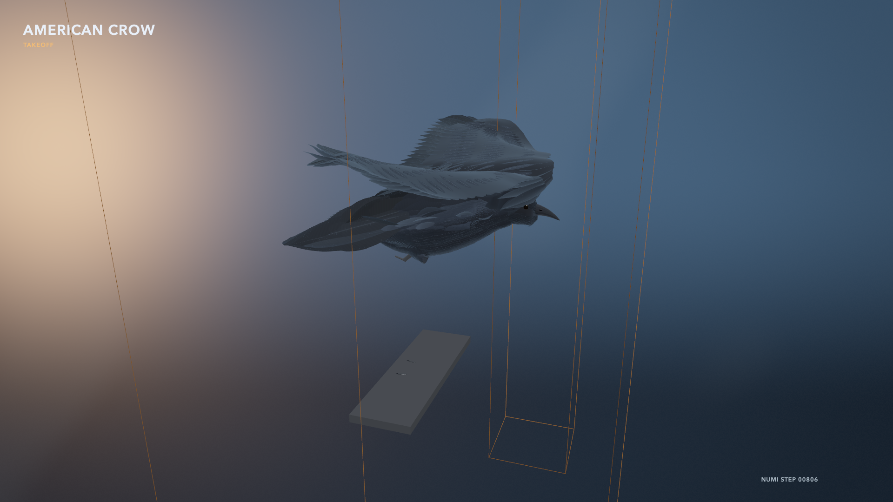
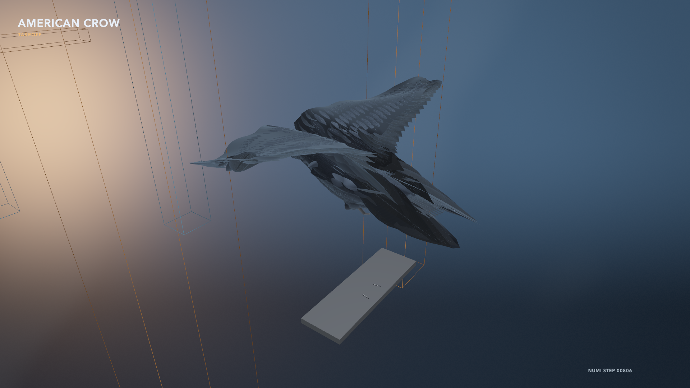

# Crow v10 accepted waypoint — multi-angle development capture

These three `1920 × 1080` native Metal frames show the same accepted Numi
simulator state at step 806 from front-three-quarter, course-side, and
elevated-rear cameras. The views use deterministic `overcast`, `clear`, and
`rim` BirdFlow lighting presets. Sparse course cages use the exact randomized
gate, slalom, and perch body centers and extents while avoiding the solid-pillar
occlusion found in the first review render.

| View | Camera `(yaw, pitch, distance m)` | Lighting | PNG SHA-256 |
| --- | --- | --- | --- |
| Front three-quarter | `(0.25, 0.18, 1.15)` | Overcast | `b99f68ec1aec97eee095974f4d5923a76ce9202e342e4264dbc2a0458bdee78f` |
| Course side | `(-1.25, 0.30, 1.22)` | Clear | `419c0253f6a9a3bc4c849a2cdf386ffac085b72568a17deaee0778d5b352c438` |
| Elevated rear | `(2.20, 0.48, 1.24)` | Rim | `2112bd152d3e37f1783e61b651c5186b980ddc40c464bfb395e3f0e6306e23c5` |

  
  
  

The immutable projection file SHA-256 is
`ed38c0f1a6e732f01db3d27bd87d2a830a7bd0342d624379289acf51683b8f40`;
its full accepted source replay is
`b01cbba6f12779ec6410ba1dc3892580c61b20bf1fac41ab39bf994ac253db91`.
The promoted PolicyPack is
`4c0711fc26137c09ba631c77f375cf4745abbf7a447be1d0ea58268f921a4c21`.
The [capture manifest](capture-manifest.json), per-angle replay audits, and
[AOV summary](aov-summary.json) retain camera, lighting, provenance, and
finite-frame checks. Full 49-frame raw captures and their hashed AOV reports
remain on the `macmini` at
`/Users/n/crow-v10-multiview-final4-20260829`.

This is a high-detail estimated BirdFlow presentation of accepted simulator
state. Accepted root height drives the retained takeoff timeline and accepted
root position places the course relative to the crow. Feather articulation is
not a joint-exact Numi reconstruction, RGB lighting does not enter the masked
metric-depth policy, and the selected controller reaches waypoint one but does
not complete the route.
