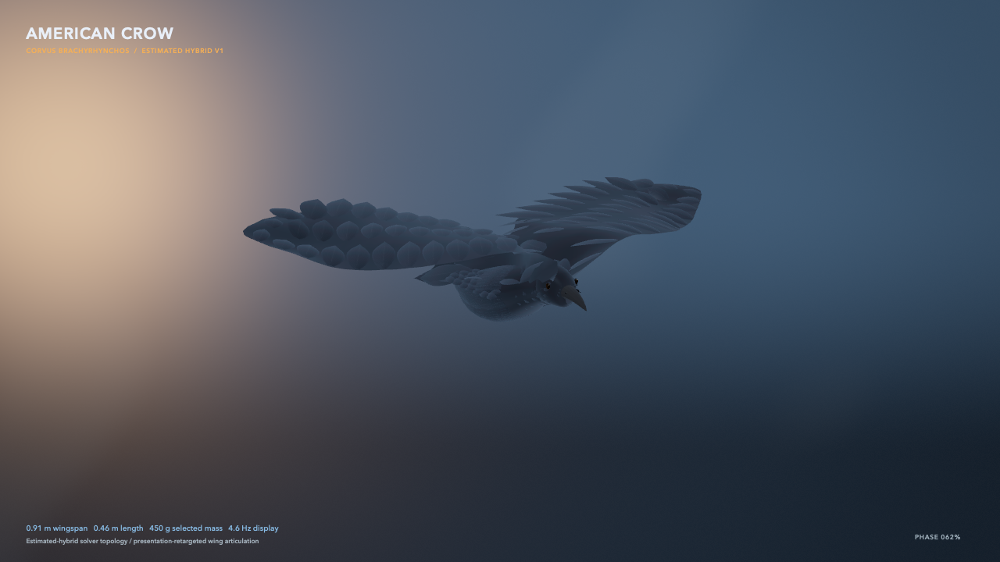
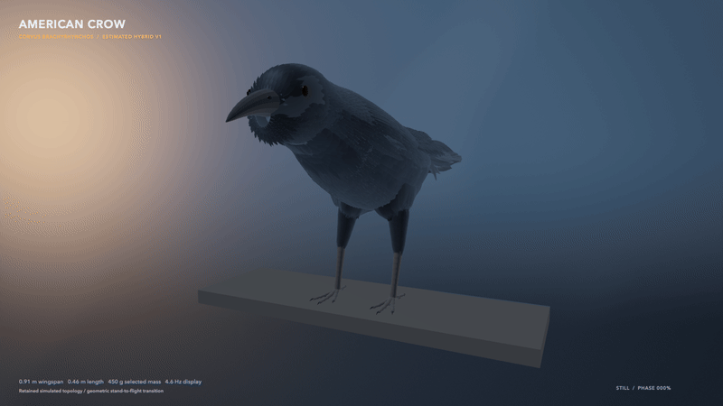

# BirdFlowMetal visual progress

This folder preserves each previously published README hero as an exact binary
from the commit that introduced it. The archive is presentation history, not
quantitative evidence; validation claims must cite the committed JSON artifacts
and an immutable Git commit.

## V1 — native fluid viewer

Commit: `85c806a` · 2026-07-15 · `896 × 504` · 40 frames · 20 fps

The first hero exposed the live D3Q19 viewer: surface pressure, a vorticity
slice, Q structures, and GPU-rendered diagnostics around the analytic bird.

## V2 — validation overlay

Commit: `99bc3a5` · 2026-07-15 · `896 × 504` · 40 frames · 20 fps

The native-fluid scene gained a compact validation-progress panel so numerical
status was visible in the animation rather than separated from it.

## V3 — measured-dove replay

Commit: `f174282` · 2026-07-16 · `1120 × 630` · 72 frames · 24 fps

The synthetic showcase was replaced by the source-locked Deetjen `OB_F03`
surface, measured/coarse-computed force history, component colors, and
kinematic wing ghosts. This revision used the earlier back-and-forth
presentation.

## V4 — continuous forward loop

Commit: `6f3dab2` · 2026-07-16 · `1120 × 630` · 72 frames · 24 fps

The replay stopped reversing. It advances monotonically through measured
samples 27–121 and uses a visibly labeled, velocity-matched 14 ms presentation
closure so the loop remains continuous without claiming periodic source data.

## V5 — D28 pre-roll frontier

Worktree snapshot: 2026-07-17 · `1120 × 630` · 72 frames · 24 fps

Lighting, hierarchy, body-following camera motion, dual-layer wingtip trails,
and the validation rail were refined. Its status was locked to the passed D28
RR3 production-margin pre-roll, with the full measured-force window still open.

SHA-256: `367010c6a2ea564d87fd6669edc56d2de196c9f478c208c59c45dab6eb74a499`

## V6 — D28 full-window frontier

Worktree snapshot: 2026-07-17 · `1120 × 630` · 72 frames · 24 fps

This exact binary locked the force chart and numerical status to the audited
D28 RR3 source-viscosity full window: 13,216 steps, 187 force bins, positive
populations, and closed momentum ledgers. D32 was still the open refinement
question.

SHA-256: `c27237257a49d0e0883fea7b32be9be23283eaafdee0a57d2baedfb2a4007dc2`

## V7 — D32 phase-localization frontier

Worktree snapshot: 2026-07-17 · `1120 × 630` · 72 frames · 24 fps

The first fine-grid hero locked the chart to the audited D32 full window,
reported the failed `5.632% > 5%` pair gate, and marked the independently
localized `25...30 ms` interval before its component replay existed.

SHA-256: `d7b511d170eeb4785487c08fae21a2e5c5d8ae4561819b1145648f0c96538147`

## V8 — targeted-boundary attribution frontier

V8 preserved the forward loop and locked its status panel to both valid D28/D32
targeted component replays plus their 15-check signed-energy audit. It reported
reflected-population self energy as the stable `58.4%` absolute-ledger leader,
while retaining the failed `5.632% > 5%` refinement boundary. The selected-link
population-versus-composition fork was still open.

SHA-256: `fdbf5533df6b06a3321aad31c338a97e0391ed296189003e34f0fab661fcbdaf`

## Archived hero — V9 reflected-link provenance

The archived [V9 animation](2026-07-17-v9-reflected-link-provenance.gif) keeps the
forward loop while improving silhouette lighting, visual hierarchy, camera
framing, dual-layer wingtip traces, file-size headroom, and validation status.
Its force chart remains artifact-locked to the independently audited D32 RR3
source-viscosity full window. The top status and `PROVENANCE` rail node are
additionally locked through the V2 selected-link preregistration, both passing
cases, the exact population/composition attribution, and its independent
16-check audit: near-wall link composition supplies `91.1%` of the absolute
ledger and leads both temporal halves. The amber chart band retains the audited
`25...30 ms` interval, while the boundary panel still reports the failed
D28/D32 `5.632% > 5%` fine-pair gate. Convergence and experimental agreement
therefore remain explicitly open. The V9 encoding is `9,557,715` bytes with
SHA-256 `f25e4ed8680a930de6d67362fe6dfffc6d91742e55e8fa99d68b5661c56afe61`;
its 73rd endpoint probe is pixel-identical to frame zero.

## Archived hero — V10 direction-composition discriminator

The [archived V10 animation](2026-07-17-v10-direction-composition-discriminator.gif) preserves
the seamless forward loop and audited D32 force chart while advancing the
scientific status through the preregistered zero-fluid conditioned-factor
discriminator. Its top panel and `DIRECTION` rail node are SHA-locked through
the six-factor contract, all 64 D28/D32 hybrid states, exact Shapley result,
and independent 18-check audit. Direction composition supplies `87.7%` of the
absolute conditioned-factor ledger and leads both temporal halves; the bottom
boundary still reports the failed `5.632% > 5%` fine-pair gate. The V10
encoding is `9,646,440` bytes with SHA-256
`23467c2e983ceee1ce7aedeb4919ebf103dcf21f481e64bdf6aca2f220b79951`;
its 73rd endpoint probe is pixel-identical to frame zero.

## Archived hero — V11 planar direction weighting cleared

The [archived V11 animation](2026-07-17-v11-planar-direction-weighting-cleared.gif) adds the
preregistered 40-case planar direction-composition canonical to the complete
artifact lock. Its top panel now reports `PLANAR D3Q19 DIRECTION WEIGHTING`,
`40 METAL/CPU CASES`, and the `1.28%` maximum analytic-vector error; the rail
advances to `PLANAR OK`. Those labels require the V2 preregistration, zero
per-direction Metal/CPU mismatch, all eight passing gates, and the independent
14-check audit. The lower boundary deliberately remains `PAIR OPEN` with
`5.632% > 5.0%`, distinguishing the cleared planar operator from unresolved
curved-surface redistribution and bird-load convergence. The V11 encoding is
`9,445,971` bytes with SHA-256
`8f401abd51624b3098f12705f920c59c2ff3100dd6b109796d83623042fe6c29`;
its 73rd endpoint probe is pixel-identical to frame zero.

## Archived hero — V12 curved dove direction mix cleared

The [archived V12 animation](2026-07-17-v12-curved-direction-mix-cleared.gif) advances the
fail-closed artifact chain through the source-locked D12/D16 complete-dove
curved direction canonical. The top panel reports `CURVED DOVE DIRECTION MIX`,
the `0.130%` whole-surface direction-histogram variation, and the `0.0091%`
maximum whole fixed-profile response change. Those labels require the exact
source link-geometry report, curved preregistration, passing seven-gate result,
and independent `14/14`-check audit in addition to every V11 source. The rail
advances to `CURVED OK`, while `PAIR OPEN` and the lower
`D28/D32 5.632% > 5.0%` boundary remain visible. The V12 encoding is
`9,424,489` bytes with SHA-256
`4ee0eaed0a6c459c4660f2647137f4f6f7edc22b339f6ef933727fcad2daa602`;
its 73rd endpoint probe is pixel-identical to frame zero.

## Archived hero — V13 fine dove direction mix cleared

The [archived V13 animation](2026-07-17-v13-fine-direction-mix-cleared.gif) extends the
artifact lock through the preregistered sample-53 D28/D32 complete-link census,
its production-Metal/independent-CPU exact parity, all eight discriminator
gates, and the independent `16/16` audit. The panel reports `0.066%`
whole-surface direction-histogram variation and `0.0012%` maximum whole
fixed-profile response change. The rail advances to `FINE OK` but ends at
`PHASE OPEN`: this result covers `26.5 ms`, not the complete `25...30 ms`
force-divergence interval. The lower `D28/D32 5.632% > 5.0%` convergence
boundary therefore remains visible. The V13 encoding is `9,378,840` bytes with
SHA-256
`a4d4c88d41fe0d4c9ad80650db5b42077af3729cda15b827a1fa4f82817ba00e`;
its 73rd endpoint probe is pixel-identical to frame zero and its encoded seam
is `0.702x` the median adjacent-frame difference.

## Current hero — V14 phase-resolved direction mix cleared

The [current README animation](../birdflow-metal-native-viewer.gif) extends the
fail-closed lock across all 11 D28/D32 source samples from `25...30 ms`. It
retains the exact-parity V1 failure as a negative control, requires the
arithmetic-only V2 tie qualification, all 22 qualified cases, all eight gates
at every phase, and the independent `18/18` audit. The top panel reports the
worst whole-surface phase-window values: `0.078%` direction-histogram variation
and `0.0032%` fixed-profile response change. The rail advances to `PHASE OK`
but ends at `WALL OPEN`, because static direction counts do not exercise wall
velocity, interpolation, or realized populations. The lower
`D28/D32 5.632% > 5.0%` convergence failure remains visible. V14 is 72
forward-only frames at 24 fps and `9,354,306` bytes with SHA-256
`9cb8afc8a5f1e661ed1ad4d959049454570b584246c4d2811921e48075425c7c`.
Its endpoint probe is pixel-identical and its encoded seam is `0.700x` the
median adjacent-frame difference.

## Formation Observatory branch — V1 c8 scout

This [archived Formation Observatory animation](2026-07-18-v1-formation-scout-observatory.gif)
introduced the two-owner native-Metal scene, independent wingbeat phase,
matched isolated-control power, the complete preregistered c8 scout map, and a
single archived CFD slice. It is preserved before the presentation advanced to
the c20 sequential result. The binary is `7,686,569` bytes with SHA-256
`961b509463da2c949c80024f448c287714226eb3930d207b2a6c01e17738fde0`.

V2 is preserved exactly as
[`2026-07-18-v2-c20-phase-observatory.gif`](2026-07-18-v2-c20-phase-observatory.gif).
It introduced the seamless scan of all 21 indexed c20 fields and the
preregistered `10.68% > 5%` stop decision. The binary is `6,550,458` bytes with
SHA-256 `6f5f77409ca9afa0eedb37f0dbad675d689c2a18c5e7e13d0ad85b980a715ec6`.

V3 is preserved exactly as
[`2026-07-18-v3-whole-bird-bilateral-bug.gif`](2026-07-18-v3-whole-bird-bilateral-bug.gif).
It introduced the complete-bird presentation shells, but its partner-wing
transform used `(-x,-y,z)`: a 180-degree z rotation rather than a sagittal
reflection. That made the two presentation wings appear to occupy different
stroke directions. The defect never entered CFD, voxelization, load, or power,
but the binary is explicitly archived as visually invalid. It is `7,155,013`
bytes with SHA-256
`3d9fce8bc5f04c93c3b4e1c0e3d9b68f619424b5f19d13b69fbe4f2c28a0aa9c`.

V4 is preserved exactly as
[`2026-07-18-v4-synchronized-procedural-birds.gif`](2026-07-18-v4-synchronized-procedural-birds.gif).
It
uses the correct sagittal `(-x,y,z)` partner transform and one shared phase for
both wings of each flyer. The intentional leader/follower `Δφ=0.25` remains.
It adds chest and shoulder shaping, paired bilateral wake guides, and a more
symmetry-readable camera while carrying the common-offset mixed source result
beside the open `10.68% > 5%` force boundary. It retains all 21 actual c20
fields and uses 48 forward-only frames at `1120 × 630`. The binary is
`7,318,268` bytes with SHA-256
`98a25ce0f167a16cbb66124740cf8d317a827529d1402994dea24fa4b31004e2`;
its endpoint probe is pixel-identical and encoded seam is `0.951x` the median
adjacent-frame change. The independent V4 visual audit passes `41/41`, including
36,864 exact bilateral vertex comparisons across both flyers and all phases.

V5 is preserved exactly as
[`2026-07-18-v5-dual-dove-windowed-cfd.gif`](2026-07-18-v5-dual-dove-windowed-cfd.gif).
It
replaces both procedural shells with independently phased copies of the locked
Deetjen OB F03 measured-derived complete dove sequence. Each flyer renders
`2,157` vertices and `3,968` triangles from frames `27...121`; a velocity-matched
`14 ms` Hermite segment closes the forward-only loop. The source evidence is
kept explicit: body and left wing derive from measured surfaces, the right wing
is a bilateral-reflection assumption, and the reconstructed tail uses a bounded
presentation scale after the first pass was visually oversized. The doves and
wingtip guides remain presentation-only; all CFD, loads, power, 21 field states,
mixed source result, and the `10.68% > 5%` stop retain their prescribed-wing
provenance. The 48-frame `1120 × 630` binary is `7,107,904` bytes with SHA-256
`dcd898e07a7f6d72e57ce1176e8207c2740cd8265b920551b52c49123e0a0ec7`;
its endpoint probe is pixel-identical and encoded seam is `0.993x` the median
adjacent-frame change. The independent V5 visual audit passes `45/45`.

V6 is preserved exactly as
[`2026-07-18-v6-dual-dove-continuous-cfd.gif`](2026-07-18-v6-dual-dove-continuous-cfd.gif).
It keeps the V5 dual-dove geometry and removes the visual CFD dropout: all
`48/48` unique phases display the nearest of 21 real archived c20 slices at
full opacity, while the HUD names the held source phase and scientific stop.
The 48-frame `1120 × 630` binary is `8,144,140` bytes with SHA-256
`54255ff84b855f2124ec0d6fbff2449bab740c6d9f61cef70c1ba89ea5298b61`;
its endpoint probe is pixel-identical and encoded seam is `1.005x` the median
adjacent-frame change. The independent V6 visual audit passes `46/46`.

V7 is preserved exactly as
[`2026-07-18-v7-cinematic-wake-bridge.gif`](2026-07-18-v7-cinematic-wake-bridge.gif).
It
removes every HUD, label, and text box, tightens the camera, and makes the two
doves and wake the complete composition. It introduces a three-ridge living
wake bridge: geometry and opacity come from cyclic interpolation between the
adjacent archived c20 vorticity/vertical-velocity fields, cyan-to-violet color
encodes wake age, and luminance follows the passed 4,820-step c18 leader-q5
reflected-population trace. The interpolation, wingtip guides, and subtle
follower-plane ring remain presentation-only. The 48-frame `1120 × 630` binary
is `7,638,548` bytes with SHA-256
`1d0dc0835512739e54e6f67352a76ed7de960ef913d38350e3744619d8800e09`;
its endpoint probe is pixel-identical and encoded seam is `0.931x` the median
adjacent-frame change. The V7 audit passes `55/55`, and the c20 convergence stop
and quantitative claim boundary remain unchanged.

V8 is preserved exactly as
[`2026-07-18-v8-figure-eight-camera.gif`](2026-07-18-v8-figure-eight-camera.gif).
It
retains the clean evidence view and replaces V7's restrained camera drift with
a spherical figure-eight. One yaw cycle and two smaller pitch lobes expose
upper, lower, left-quarter, and right-quarter silhouettes while a small radial
variation preserves framing through both lobes. The wrapped path returns to
exactly the frame-zero camera parameters. The 48-frame `1120 × 630` binary is
`7,756,091` bytes with SHA-256
`f4af3b62318d0fffd1d2e41fa157cf12e3a054400ba7ba6d4e9973448bde3564`;
its endpoint probe is pixel-identical and encoded seam is `0.943x` the median
adjacent-frame change. The V8 audit passes `56/56`; camera motion is
presentation-only and the scientific claim boundary is unchanged.

V9 is preserved exactly as
[`2026-07-19-v9-seamless-field-figure-eight.gif`](2026-07-19-v9-seamless-field-figure-eight.gif).
It
removes the diagonal dark beam that V8's wider camera path exposed in the flow
plane. Isolation renders proved the stroke was not a wingtip guide or wake
ridge. V9 applies a mask-aware radius-4, sigma-2 Gaussian presentation filter,
fills the hidden canonical solid gap from surrounding archived fluid samples,
and uses both vorticity and absolute vertical velocity for opacity. The source
arrays and owner mask remain unchanged. The 48-frame `1120 × 630` binary is
`7,581,213` bytes with SHA-256
`b17a669ee923ad17281316577c28c704b4ae27d86f912d59b5ec29f533cbb65e`;
its endpoint probe is pixel-identical and encoded seam is `0.960x` the median
adjacent-frame change. The V9 audit passes `57/57`; the spatial filtering and
gap fill are presentation-only and the scientific boundary is unchanged.

The [current V10 Formation Observatory animation](../formation-flight-observatory.gif)
adds an exact D3Q19 collision-streaming lens on a positive-`x` archived c20
wake ridge. The center is the rest population; six axial and twelve
face-diagonal nodes are the 18 moving populations; and phase-locked packets
stream outward on every link. The gold positive-`z` packet follows the complete
leader-q5 source trace. `RGBA16Float` rendering, a half-resolution 25-tap
selective bloom, bounded highlight rolloff, and one batched wake strip improve
depth while reducing per-ribbon allocations and draws. Eight-angle review plus
targeted adjacent-frame inspection caught and corrected a transient surface
vertex-buffer binding error. The 48-frame `1120 × 630` binary is `8,024,801`
bytes with SHA-256
`e64059a079e2f6c51cfd9f5e288b9e219895ab446a51d51b668693ceb7e1d064`;
its endpoint is pixel-identical, encoded seam is `0.979x` the median adjacent
change, and maximum high-edge density is `1.182x` the median. The lens and all
finishing remain presentation-only. The V10 audit passes `64/64` checks.

## Simulated American crow branch — V1 native wingbeat

Commit: `e520856` · 2026-08-16 · `1280 × 720` still and H.264 clip · 24 fps ·
2.0 s

This dated capture records the native Metal estimated-crow wingbeat presentation
introduced with the body-integrated flight wings. The still is `903,967` bytes
with SHA-256
`cb990bd413683767e252e85fb54d0a1a82dece1383285494476a5766418b8d81`; the
linked clip is `243,201` bytes with SHA-256
`83fd17ae078abd49fb195d8d6ac6d4f3334058ecdc7284c381ff0704e8870b54`.

The crow’s geometry, feathering, pose, and wingbeat are simulated/estimated.
This capture is not real crow footage, same-specimen kinematics, measured crow
aerodynamics, or a quantitative validation result.

## Simulated American crow branch — V2 standing to flight

Commit: `7a23b3b` · 2026-08-24 · `800 × 450` · 72 frames · 25 fps · 3.0 s

This exact GIF records the standing, small body-motion, takeoff, and flight
transition after the simulated plumage/body continuity pass. It is `7,886,767`
bytes with SHA-256
`73c2ab9abc0ec2bb25cbc47cbc53f029cf878ae916f2b110f6085c384db7b964`.

It is a dated visual-development capture, not a claim that the model is
indistinguishable from a real crow. The current full-image retained-plumage ray
audit remains diagnostic-only: raster depth and identity retain visibility
authority while mapped acceleration-structure misses and owner substitutions are
investigated.
