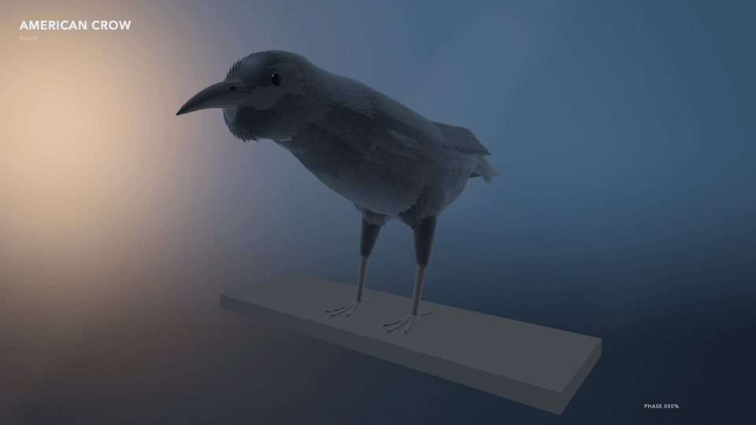

# BirdFlowMetal

<p align="center">
  <strong>GPU-native, three-dimensional fluid–body research for articulated bird flight on Apple silicon.</strong>
</p>

<p align="center">
  
  
  
  
  
</p>

## Current native flight gallery

### Deetjen dove — native Metal viewer


<p align="center"><em>Native Metal rendering of the reconstructed Deetjen dove through a forward, body-following wingbeat interval. Surface trails are kinematic; they are not CFD streamlines.</em></p>

### Deetjen dove — Numi Lab flight replay

<p align="center">
  
  
</p>

<p align="center"><em>Two recorded viewpoints of the provenance-locked Deetjen surface replay. Cyan is the measured left wing; orange is the reflected-right-wing assumption.</em></p>

### American crow — standing to flight

<p align="center">
  
</p>

<p align="center"><em>Native Metal simulation of an estimated American-crow model moving from standing through takeoff to flapping flight. It is simulated geometry and motion—not camera footage or measured crow aerodynamics.</em></p>

### American crow — Numi Lab journey

<p align="center">
  <a href="Docs/Media/numi-crow-takeoff-cruise-v2.mp4"></a>
</p>

<p align="center"><em>Standing, takeoff, front, side, and rear views of the estimated feathered model, keyed to a selected autonomous policy that passed three-seed takeoff/cruise physics gates. These are presentation pixels—not Numi sensor pixels or a joint-exact state replay.</em></p>

<p align="center">
  
  <a href="Docs/Media/american-crow-hybrid-native-v1.mp4"></a>
</p>

<p align="center"><em>Left: Deetjen through-flight field observatory. Right: the latest native crow flight still; select it for the full 1280×720 native Metal wingbeat clip.</em></p>

The gallery intentionally includes every current, tracked crow and Numi Lab dove flight capture. The [visual progress archive](Docs/Media/Progress/README.md) holds earlier developmental captures separately, so the landing page stays focused on the latest media.

## What this repository demonstrates

BirdFlowMetal advances a D3Q19 fluid state on the GPU, evaluates articulated moving boundaries, exchanges momentum with those boundaries, reduces aerodynamic force and torque, and can integrate a six-degree-of-freedom rigid body. It includes native scientific visualization, source-locked motion replay, independent reference algebra, and versioned validation artifacts.

| Shown here | Appropriate interpretation |
| --- | --- |
| Dove replay and viewer | Native rendering and source-locked surface/kinematics presentation. |
| Crow sequence | A constrained, estimated procedural model rendered on Apple silicon. |
| Field observatory | A presentation of archived solver readback; visualizations are not quantitative validation by themselves. |
| Solver benchmarks | The fixed-thickness prescribed flapping-wing canonical is quantitatively accepted. Complete measured-bird and free-flight claims remain open. |

> [!IMPORTANT]
> **Scientific boundary:** Engineering milestones, screenshots, GIFs, and renderer parity are not substitutes for grid convergence, force validation, or experimental agreement. The project keeps the associated evidence and limitations explicit.

## Start here

- [Research reference](RESEARCH.md) — full methods, architecture, benchmarks, commands, source provenance, and acceptance boundaries previously carried by this README.
- [Validation record](Docs/VALIDATION.md) — acceptance logic and artifact-backed results.
- [Numerics](Docs/NUMERICS.md) — equations and solver design.
- [Measured-bird data contract](Docs/MEASURED_BIRD_DATA.md) — input schema, provenance, and missing-data boundaries.
- [Deetjen through-flight](Docs/DEETJEN_DOVE_THROUGH_FLIGHT.md) — prescribed-motion CFD scope and artifact contract.
- [American crow model](Docs/AMERICAN_CROW_MODEL.md) — model construction and explicitly simulated constraints.
- [Numi crow journey](Docs/NUMI_CROW_JOURNEY.md) — locomotion/flight task, teacher distillation, held-out result, and render boundary.
- [Formation Flight Observatory](Docs/FORMATION_FLIGHT_OBSERVATORY.md) — visual/field observatory provenance.
- [Visual progress archive](Docs/Media/Progress/README.md) — dated captures and their context.

## Quick start

Requirements: macOS with Apple silicon, Xcode/Swift 6, and Metal support.

```bash
swift build -c release
swift test -c release
```

For the reproducible commands, exact thresholds, current qualifications, and known open gates, use the [research reference](RESEARCH.md) rather than inferring claims from the media above.

## License

BSD-3-Clause. See [LICENSE](LICENSE).
